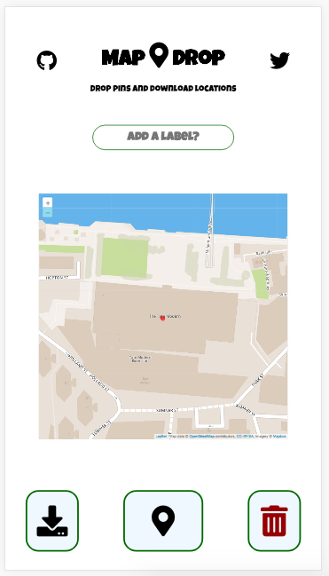

# MapDrop

A tiny application to enable collection and export of locations on your device.

## Usage

MapDrop is a static site and runs entirely client-side - no data is synced anywhere else.



1. Add an optional label
2. Drop a pin!
3. Download your pins as a CSV.

```csv
time,label,lat,long
2020-01-01T13:37:00.000Z,,78.393507,21.309775
2020-01-01T13:37:10.000Z,some-place,78.393507,21.309775
2020-01-01T13:37:20.000Z,other-place,78.393507,21.309775
2020-01-01T13:37:30.000Z,cool-place,78.393507,21.309775
```
